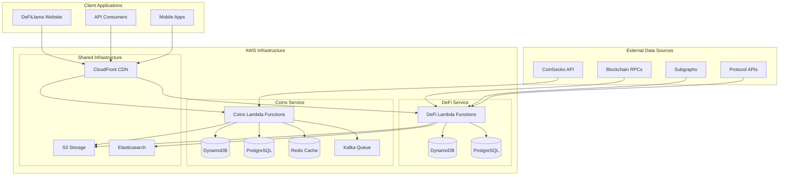
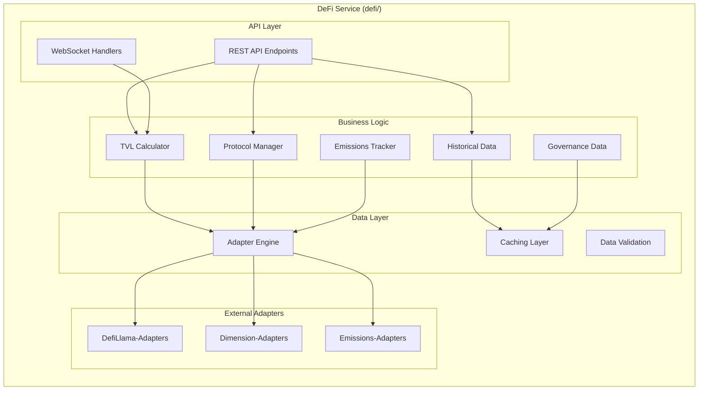
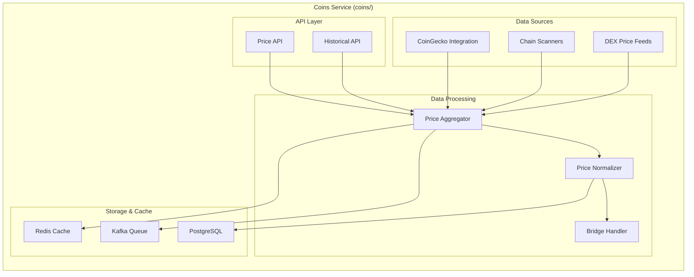
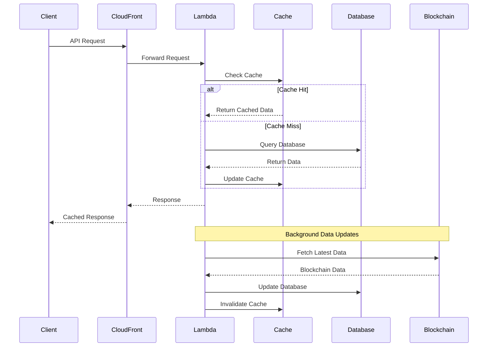

# DeFiLlama Server - System Architecture

*Generated by BMAD Method v6.0.0-alpha.0 on 2025-10-13*

## 🏗️ High-Level Architecture

DeFiLlama Server implements a **serverless microservices architecture** on AWS, designed for high scalability, cost efficiency, and global availability. The system processes billions of data points daily from 100+ blockchains to provide real-time DeFi analytics.



## 🎯 Service Architecture

### DeFi Service Architecture

**Purpose**: Core DeFi analytics and TVL tracking service



### Coins Service Architecture

**Purpose**: Multi-chain cryptocurrency price aggregation and distribution



## 🗄️ Data Architecture

### Database Design

**DynamoDB (NoSQL)**
- **Purpose**: High-throughput operational data
- **Tables**: 
  - `prod-table` (DeFi service)
  - `prod-coins-table` (Coins service)
- **Access Patterns**: Time-series queries, protocol lookups
- **Partitioning**: By protocol ID and timestamp

**PostgreSQL (Relational)**
- **Purpose**: Complex queries and analytics
- **Schema**: Normalized protocol and price data
- **Features**: Full-text search, complex joins, historical analysis
- **Backup**: Automated daily snapshots

**Redis (Cache)**
- **Purpose**: High-frequency price data caching
- **TTL**: 30 seconds to 5 minutes depending on data type
- **Patterns**: Price lookups, rate limiting, session storage

### Data Flow Architecture



## ⚡ Performance Architecture

### Caching Strategy

**Multi-Layer Caching**:
1. **CloudFront (CDN)**: 5-60 minutes for static data
2. **Redis**: 30 seconds - 5 minutes for dynamic data  
3. **Application Cache**: In-memory caching for computed values
4. **Database Query Cache**: PostgreSQL query result caching

### Scaling Patterns

**Horizontal Scaling**:
- Lambda auto-scaling based on request volume
- DynamoDB on-demand scaling
- Redis cluster mode for high availability

**Vertical Optimization**:
- Memory optimization for Lambda functions (250MB - 10GB)
- Database connection pooling
- Batch processing for bulk operations

## 🔒 Security Architecture

### Authentication & Authorization
- **API Keys**: Rate-limited public API access
- **AWS IAM**: Service-to-service authentication
- **VPC**: Network isolation for databases
- **Encryption**: TLS 1.3 for data in transit, AES-256 for data at rest

### Data Protection
- **Input Validation**: Comprehensive request validation
- **Rate Limiting**: Per-IP and per-API-key limits
- **DDoS Protection**: CloudFront + AWS Shield
- **Monitoring**: AWS X-Ray + CloudWatch for anomaly detection

## 🌍 Deployment Architecture

### Infrastructure as Code
```yaml
# Serverless Framework Configuration
service: defillama
provider:
  name: aws
  runtime: nodejs20.x
  region: eu-central-1
  stage: ${opt:stage, 'dev'}
  
functions:
  api:
    handler: src/handler.api
    events:
      - http:
          path: /{proxy+}
          method: ANY
    environment:
      tableName: ${self:custom.tableName}
```

### CI/CD Pipeline
1. **Code Commit**: GitHub repository
2. **Build**: Serverless Framework packaging
3. **Test**: Jest unit and integration tests
4. **Deploy**: Automated deployment to dev/prod
5. **Monitor**: CloudWatch metrics and alarms

### Environment Management
- **Development**: `dev` stage with reduced resources
- **Production**: `prod` stage with full scaling
- **Configuration**: Environment-specific variables
- **Secrets**: AWS Secrets Manager integration

## 📊 Monitoring & Observability

### Metrics & Logging
- **Application Metrics**: Custom CloudWatch metrics
- **Performance Monitoring**: AWS X-Ray distributed tracing
- **Error Tracking**: Sentry integration (coins service)
- **Log Aggregation**: CloudWatch Logs with structured logging

### Health Checks
- **API Health**: Automated endpoint monitoring
- **Database Health**: Connection and query performance
- **Cache Health**: Redis cluster monitoring
- **External Dependencies**: Blockchain RPC monitoring

## 🔄 Data Synchronization

### Real-time Updates
- **WebSocket Connections**: Live price feeds
- **Event-Driven Architecture**: Kafka message queues
- **Background Jobs**: Scheduled Lambda functions
- **Change Data Capture**: Database triggers for cache invalidation

### Batch Processing
- **Historical Data**: Daily batch jobs for historical analysis
- **Data Validation**: Periodic data integrity checks
- **Backup & Archive**: Automated data archival to S3

---

*This architecture documentation was generated using BMAD Method v6.0.0-alpha.0 system analysis.*
