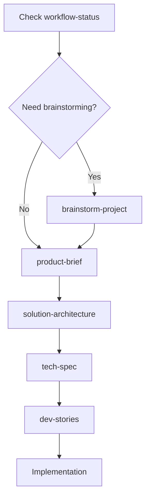
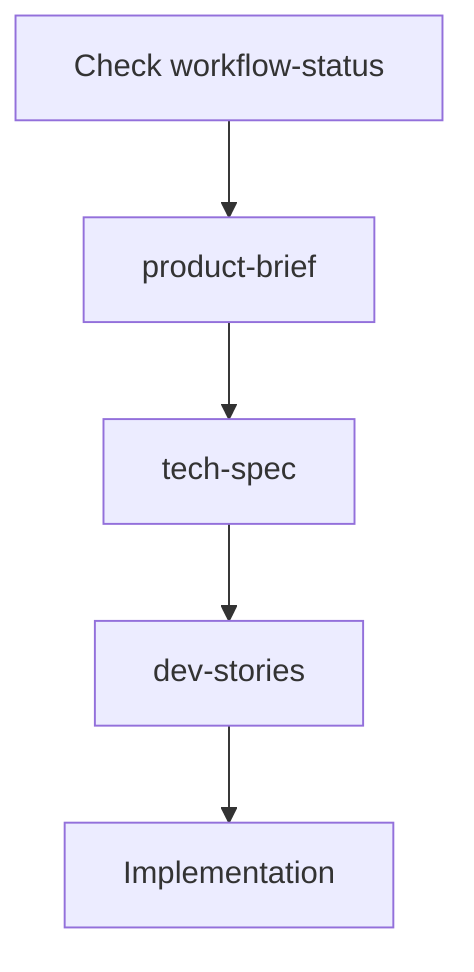

# DeFiLlama Server - Development Workflow

*Complete workflow for developing new features using BMAD Method*

## 🎯 Overview

This guide outlines the complete development workflow for adding new features to DeFiLlama Server using the BMAD Method framework. Follow this process to ensure consistent, high-quality feature development.

## 📋 Phase 1: Analysis (Optional but Recommended)

### When to Use Analysis Phase
- New feature areas you're unfamiliar with
- Complex integrations or architectural changes
- Need to research technical approaches
- Stakeholder alignment required

### Available Workflows

#### 1. Brainstorm Project (`*brainstorm-project`)
**Agent:** analyst (Mary)  
**Purpose:** Generate and evaluate feature ideas  
**Output:** Feature opportunity list with priorities  

```bash
# Load analyst agent and run:
*brainstorm-project
```

#### 2. Research (`*research`)
**Agent:** analyst (Mary)  
**Purpose:** Technical research and feasibility analysis  
**Output:** Research findings and recommendations  

```bash
# Load analyst agent and run:
*research
```

#### 3. Product Brief (`*product-brief`)
**Agent:** analyst (Mary)  
**Purpose:** Create detailed feature requirements  
**Output:** Comprehensive product requirements document  

```bash
# Load analyst agent and run:
*product-brief
```

## 🏗️ Phase 2: Planning (Required)

### Planning Workflows

#### 1. Solution Architecture (`*solution-architecture`)
**Agent:** architect (Winston)  
**Purpose:** Design system architecture for the feature  
**Output:** Architecture design and integration plan  

```bash
# Load architect agent and run:
*solution-architecture
```

#### 2. Tech Spec (`*tech-spec`)
**Agent:** architect (Winston)  
**Purpose:** Create detailed technical specifications  
**Output:** Implementation-ready technical specifications  

```bash
# Load architect agent and run:
*tech-spec
```

## 🚀 Phase 3: Implementation

### Implementation Workflows

#### 1. Development Stories (`*dev-stories`)
**Agent:** sm (Scrum Master)  
**Purpose:** Break down features into development stories  
**Output:** Sprint-ready development stories  

```bash
# Load sm agent and run:
*dev-stories
```

#### 2. Implementation
**Agent:** dev (Developer)  
**Purpose:** Execute development stories  
**Output:** Working code and tests  

## 📊 Recommended Workflow Sequences

### For New Features (Level 2-3 Projects)



**Complete Sequence:**
1. `*workflow-status` - Check current project status
2. `*brainstorm-project` - Generate feature ideas (optional)
3. `*product-brief` - Define requirements
4. `*solution-architecture` - Design system changes
5. `*tech-spec` - Create technical specifications
6. `*dev-stories` - Break into development tasks
7. Implementation - Execute development

### For Quick Features (Level 0-1 Projects)



**Simplified Sequence:**
1. `*workflow-status` - Check current status
2. `*product-brief` - Define requirements
3. `*tech-spec` - Technical specifications
4. `*dev-stories` - Development tasks
5. Implementation - Execute development

## 🔄 Workflow Commands

### Check Status
```bash
# Load any agent (analyst, architect, sm) and run:
*workflow-status
```

### Analysis Phase Commands
```bash
# Load analyst agent
*brainstorm-project    # Feature ideation
*research             # Technical research  
*product-brief        # Requirements definition
```

### Planning Phase Commands
```bash
# Load architect agent
*solution-architecture # System design
*tech-spec            # Technical specifications
*validate-architecture # Validate design
*validate-tech-spec   # Validate specifications
```

### Implementation Phase Commands
```bash
# Load sm (Scrum Master) agent
*dev-stories          # Create development stories
*sprint-planning      # Plan development sprints

# Load dev agent
*implementation       # Execute development
*code-review         # Review code changes
```

## 📁 File Organization

### Documentation Structure
```
docs/
├── index.md                          # Project overview
├── architecture.md                   # System architecture
├── component-inventory.md            # Component catalog
├── development-guide.md              # Development setup
├── api-contracts.md                  # API documentation
├── development-workflow.md           # This file
├── feature-development-template.md   # Feature template
├── project-workflow-status-YYYY-MM-DD.md  # Workflow status
└── features/                         # Feature documentation
    ├── feature-name/
    │   ├── requirements.md           # Product brief output
    │   ├── architecture.md           # Solution architecture
    │   ├── tech-spec.md             # Technical specifications
    │   └── stories.md               # Development stories
    └── ...
```

### Code Organization
```
defi/src/
├── api/                    # API endpoints
├── protocols/              # Protocol adapters
├── services/              # Business logic services
├── models/                # Data models
├── utils/                 # Utility functions
└── __tests__/             # Test files

coins/src/
├── api/                   # Price API endpoints
├── adapters/              # Price adapters
├── services/              # Price services
├── models/                # Data models
└── __tests__/             # Test files
```

## 🧪 Testing Workflow

### Test-Driven Development
1. **Write tests first** - Define expected behavior
2. **Implement feature** - Make tests pass
3. **Refactor** - Improve code quality
4. **Integration tests** - Test service interactions

### Testing Commands
```bash
# Run tests for specific service
cd defi && npm test
cd coins && npm test

# Run tests with coverage
npm test -- --coverage

# Run specific test file
npm test -- protocols/ethereum.test.ts
```

## 🚀 Deployment Workflow

### Development Deployment
```bash
# Deploy to development environment
cd defi && npm run deploy:dev
cd coins && npm run deploy:prod  # Only has prod stage
```

### Production Deployment
```bash
# Deploy to production
cd defi && npm run deploy:prod

# Monitor deployment
aws logs tail /aws/lambda/defillama-prod-api --follow
```

## 📈 Monitoring & Feedback

### Performance Monitoring
- **Response Times**: Monitor API response times
- **Error Rates**: Track error rates and types
- **Usage Metrics**: Monitor feature adoption
- **Business KPIs**: Track business impact

### Feedback Loop
1. **Deploy feature** - Release to production
2. **Monitor metrics** - Track performance and usage
3. **Collect feedback** - User and stakeholder feedback
4. **Iterate** - Improve based on learnings

## 🔧 Tools & Resources

### BMAD Method Agents
- **analyst** (Mary) - Business analysis and requirements
- **architect** (Winston) - System architecture and design
- **sm** (Scrum Master) - Project management and stories
- **dev** (Developer) - Implementation and coding

### Development Tools
- **VS Code** - Primary IDE
- **AWS CLI** - Cloud deployment
- **Serverless Framework** - Infrastructure as code
- **Jest** - Testing framework
- **Prettier** - Code formatting

### Documentation Tools
- **Markdown** - Documentation format
- **Mermaid** - Diagrams and flowcharts
- **BMAD Method** - Workflow framework

## 🎯 Best Practices

### Planning
- ✅ Always start with `*workflow-status`
- ✅ Use appropriate workflow sequence for project level
- ✅ Document decisions in workflow status file
- ✅ Validate architecture before implementation

### Development
- ✅ Follow test-driven development
- ✅ Write comprehensive tests
- ✅ Update documentation with changes
- ✅ Use feature flags for gradual rollouts

### Deployment
- ✅ Deploy to development first
- ✅ Run integration tests
- ✅ Monitor metrics after deployment
- ✅ Have rollback plan ready

---

*This workflow guide integrates with BMAD Method v6.0.0-alpha.0 for systematic feature development.*
